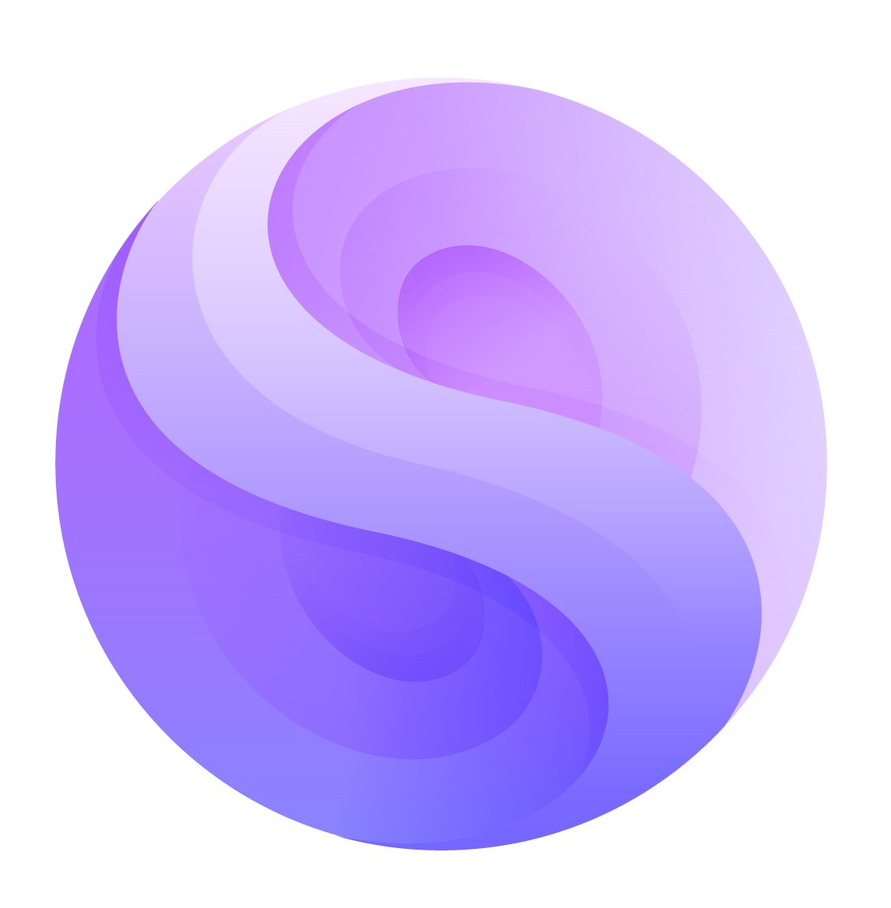

<h1 align="center">
  <a href="https://libmediadevice.example"></a>
  <br>
  libMediaDevice
  <br>
</h1>
<h4 align="center">A modern C/C++ library for interfacing with low-level media devices across multiple platforms</h4>
<p align="center">
    <a href="https://libmediadevice.example"></a>
    <a href="LICENSE"></a>
    <br>
    <a href="https://github.com/media-lib/libMediaDevice"></a>
</p>
<br>

### New Release

libMediaDevice v1.0.0 has been released! See the [release notes](https://github.com/media-lib/libMediaDevice/wiki/Release-libMediaDevice@v1.0.0) to learn about new features, enhancements, and breaking changes.

If you aren't ready to upgrade yet, check the [tags](https://github.com/media-lib/libMediaDevice/tags) for previous stable releases.

We appreciate your feedback! Feel free to open GitHub issues or submit changes to stay updated in development and connect with the maintainers.

-----

### Usage

libMediaDevice is distributed as a pure C/C++ library. To integrate it into your project, ensure you have a compatible C/C++ compiler and the necessary build tools. Clone the repository and link against the library in your build system.

## Simple API
<table>
<tr>
<th> Video Device </th>
<th> Audio Device </th>
</tr>
<tr>
<td>

```cpp
#include <mediadevice.h>

// NVIDIA Device
media::VideoDeviceConfig config;
config.type = media::VideoDeviceType::NVFBC;
config.capture_cursor = true;
config.display_id = ":0";

auto video_device = media::VideoDevice::Create(config);
if (!video_device) {
    std::cerr << "Failed to create NVFBC video device!" << std::endl;
    std::cerr << "Note: NVFBC requires NVIDIA GPU and drivers" << std::endl;
    return 1;
}
    
std::cout << "Successfully created NVFBC video device" << std::endl;
std::cout << "Display resolution: " << video_device->GetWidth() << "x" << video_device->GetHeight() << std::endl;

std::vector<uint8_t> nv12_buffer;

bool nv12_success = false;

// NV12 format
nv12_success = video_device->GetFrameNV12(&nv12_buffer);
if (nv12_success) {
    std::cout << "Successfully captured NV12 frame " << (i + 1)
                << " (" << nv12_buffer.size() << " bytes)" << std::endl;
}
```

</td>
<td>

```cpp
#include <mediadevice.h>

media::AudioDeviceConfig config;
config.type = media::AudioDeviceType::PULSE;
config.sample_rate = 44100;
config.channels = 2;
config.buffer_ms = 100;
config.device_id = "";  // Use default audio device
    
// Create the audio device
auto audio_device = media::AudioDevice::Create(config);
if (!audio_device) {
    std::cerr << "Failed to create PulseAudio device!" << std::endl;
    return 1;
}

int bytes_per_frame = actual_config.channels * 2;
int expected_bytes = (actual_config.sample_rate * bytes_per_frame * actual_config.buffer_ms) / 1000;

// audio frames
std::vector<uint8_t> audio_buffer;

if (audio_device->GetFrameS16LE(&audio_buffer)) {
    std::cout << "Successfully captured audio frame " << (i + 1) 
                << " (" << audio_buffer.size() << " bytes)" << std::endl;
}
```

</td>
</tr>
</table>

**[Example Applications](examples/README.md)** contain code samples demonstrating common use cases with libMediaDevice.

**[API Documentation](https://libmediadevice.example/docs)** provides a comprehensive reference of our Public APIs.

Now go build something amazing! Here are some ideas to spark your creativity:
* Create cross-platform media stream applications with consistent APIs.
* Develop GPU hardware-accelerated media streaming solutions.
* Implement digital signage solutions with direct hardware access.

## Building

See [BUILDING.md](https://github.com/media-lib/libMediaDevice/blob/master/BUILDING.md) for building instructions.

### Features

#### Cross-Platform Device Access
* Uniform API for cameras, microphones, displays, and audio outputs across platforms.
* Direct hardware access with modern abstraction layers for Windows, macOS, Linux, and more.

#### Modern Interface Design
* Simplified, consistent API that hides platform-specific complexity.
* Event-driven architecture with callbacks for device state changes.

#### Performance Focused
* Zero-copy operations where supported by hardware.
* Minimal overhead for maximum throughput and reduced latency.

#### Device Control
* Comprehensive device parameter control (exposure, gain, color settings, etc.).
* Hardware capability discovery and feature negotiation.

#### Pure C/C++
* Written entirely in C/C++ with minimal dependencies for maximum performance.
* Wide platform support: Windows, macOS, Linux, FreeBSD, Android, and more.

### Contributing

Check out the [contributing guide](https://github.com/media-lib/libMediaDevice/wiki/Contributing) to join the team of dedicated contributors making this project possible.

### License

MIT License - see [LICENSE](LICENSE) for full text